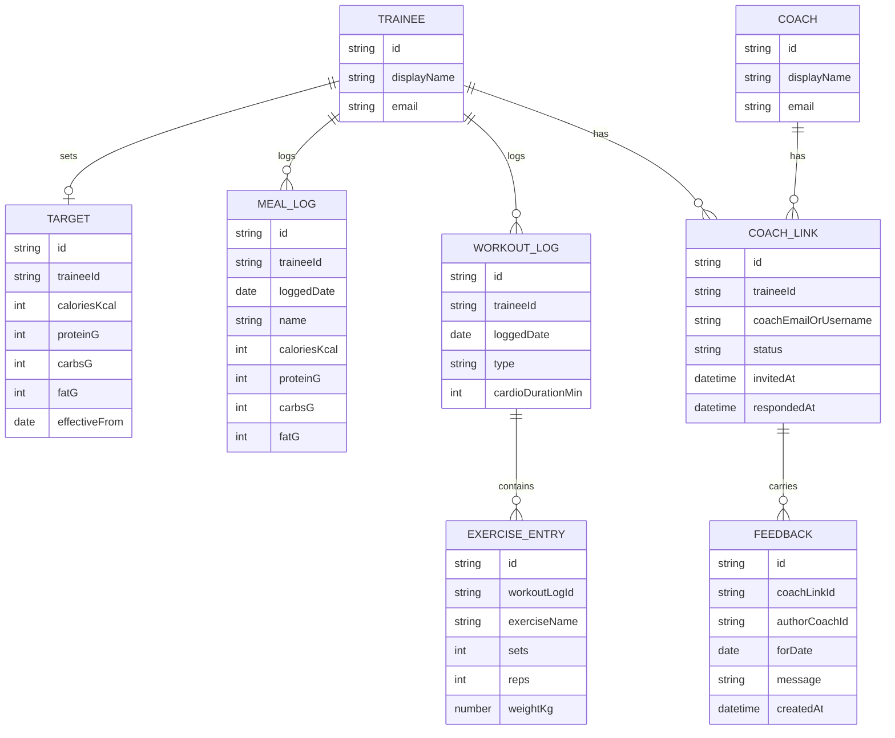

# Domain Model

The core entities behind targets, logs, coaching links, and feedback.

A `WORKOUT_LOG` is either strength (one or more `EXERCISE_ENTRY` rows) or cardio
(`cardioDurationMin` set, no exercise entries). `COACH_LINK.status` moves
`pending -> accepted` (or `revoked`); a Coach only reaches a Trainee's data
through an `accepted` link. `FEEDBACK` is always authored by the Coach side of
an accepted `COACH_LINK` and read by the linked Trainee.