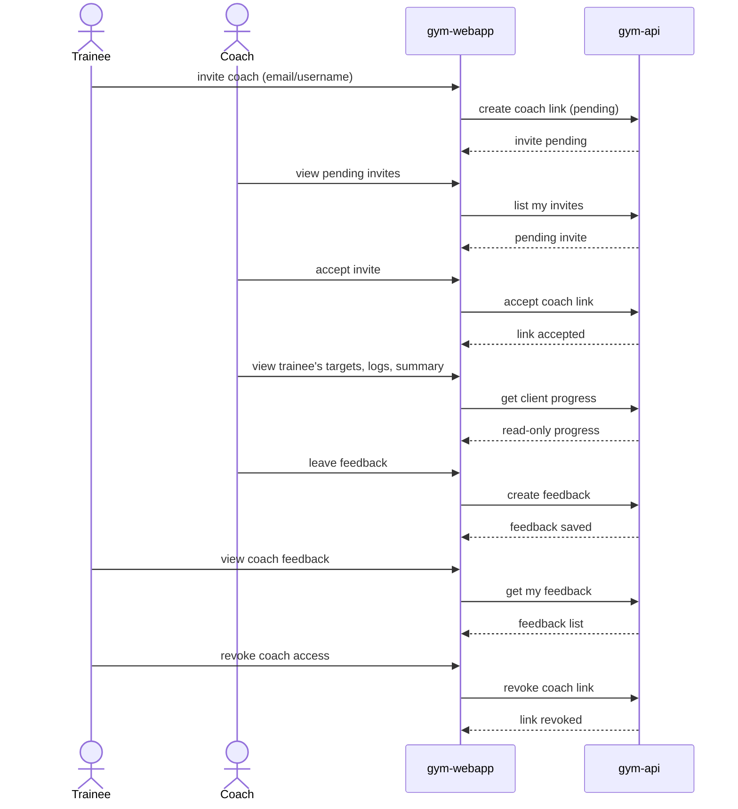

# Coach invite and feedback

A Trainee invites a Coach, the Coach accepts and reviews progress, leaves
feedback, and the Trainee can revoke access at any time.

```mermaid
sequenceDiagram
    actor Trainee
    actor Coach
    participant gymwebapp as gym-webapp
    participant gymapi as gym-api

    Trainee->>gymwebapp: invite coach (email/username)
    gymwebapp->>gymapi: create coach link (pending)
    gymapi-->>gymwebapp: invite pending
    Coach->>gymwebapp: view pending invites
    gymwebapp->>gymapi: list my invites
    gymapi-->>gymwebapp: pending invite
    Coach->>gymwebapp: accept invite
    gymwebapp->>gymapi: accept coach link
    gymapi-->>gymwebapp: link accepted
    Coach->>gymwebapp: view trainee's targets, logs, summary
    gymwebapp->>gymapi: get client progress
    gymapi-->>gymwebapp: read-only progress
    Coach->>gymwebapp: leave feedback
    gymwebapp->>gymapi: create feedback
    gymapi-->>gymwebapp: feedback saved
    Trainee->>gymwebapp: view coach feedback
    gymwebapp->>gymapi: get my feedback
    gymapi-->>gymwebapp: feedback list
    Trainee->>gymwebapp: revoke coach access
    gymwebapp->>gymapi: revoke coach link
    gymapi-->>gymwebapp: link revoked
```

