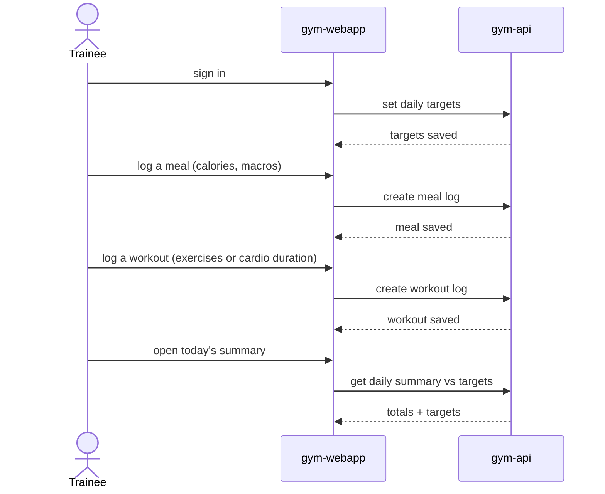

# Trainee daily tracking

A signed-in Trainee sets targets, logs a meal and a workout, then checks their
daily summary against target.

```mermaid
sequenceDiagram
    actor Trainee
    participant gymwebapp as gym-webapp
    participant gymapi as gym-api

    Trainee->>gymwebapp: sign in
    gymwebapp->>gymapi: set daily targets
    gymapi-->>gymwebapp: targets saved
    Trainee->>gymwebapp: log a meal (calories, macros)
    gymwebapp->>gymapi: create meal log
    gymapi-->>gymwebapp: meal saved
    Trainee->>gymwebapp: log a workout (exercises or cardio duration)
    gymwebapp->>gymapi: create workout log
    gymapi-->>gymwebapp: workout saved
    Trainee->>gymwebapp: open today's summary
    gymwebapp->>gymapi: get daily summary vs targets
    gymapi-->>gymwebapp: totals + targets
```

